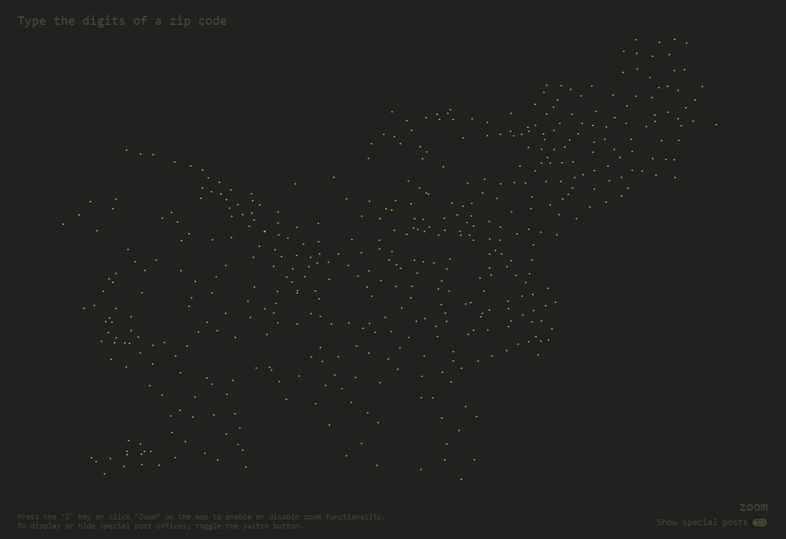

# Vizualizacija Pošt Slovenije

## Projektna naloga pri predmetu Interaktivnost in oblikovanje informacij

### Fakulteta za računalništvo in informatiko, Univerza v Ljubljani

**Avtor:** Katarina Gojkivić
**Asistent:** pred. dr. Borut Batagelj
**Profesor:** prof. dr. Franc Solina

---

### Kratek opis projekta

V okviru projektne naloge smo ustvarili interaktivno vizualizacijo, ki omogoča vpogled v geografsko razporeditev poštnih uradov v Sloveniji ter ponazarja povezavo med poštnimi številkami in lokacijo krajev. Projekt združuje podatke o slovenskih poštnih številkah z njihovimi geografskimi lokacijami, pri čemer uporabniku ponuja dinamičen in intuitiven način za raziskovanje.

Aplikacijo olahko preizkusite na povezavi: [Demo](https://kaatarina1.github.io/IOI_Vizualizacija/)

### Povezava poštnih številk z regijami in geografsko razporeditvijo

Poštne številke v Sloveniji so zasnovane tako, da prva števka označuje geografsko območje oziroma poslovno enoto (PE) Pošte Slovenije. Preostale tri števke natančneje določajo posamezno poštno enoto znotraj tega območja. Ta sistem omogoča učinkovito usmerjanje in dostavo poštnih pošiljk.

Poštne številke so razdeljene po naslednjih območjih:

-   **1xxx**: PE Ljubljana
-   **2xxx**: PE Maribor
-   **3xxx**: PE Celje
-   **4xxx**: PE Kranj
-   **5xxx**: PE Nova Gorica
-   **6xxx**: PE Koper - Capodistria
-   **8xxx**: PE Novo mesto
-   **9xxx**: PE Murska Sobota

Na primer, poštna številka **1000** označuje glavno pošto v Ljubljani, medtem ko **2000** označuje glavno pošto v Mariboru. V večjih mestih se dostava pogosto označi s kombinacijo **000** (npr. **1000 Ljubljana**), poštni predali pa z **001** (npr. **1001 Ljubljana**).

Posebne poštne številke, ki jih uporabljajo podjetja, banke in druge ustanove, pogosto odstopajo od geografskega vzorca. Ta raznolikost omogoča hitro in učinkovito razvrščanje poštnih storitev.

---

---

### Funkcionalnosti vizualizacije

1. **Interaktivna vizualizacija:**

    - Zemljevid Slovenije, ki vizualizira lokacije poštnih uradov, kot pike na zemljevidu.
    - Osvetlitev in zatemnitev pik na zemljevidu glede na vnesene poštne številke.
    - Povečava zemljevida za podroben pregled posameznih pošt.
    - Izpis imena pošte, ko se z miško premaknemo na pripadajočo piko

2. **Raziskovanje vzorcev:**

    - Možnost raziskovanja povezave med poštnimi številkami in geografskimi regijami.

3. **Izbor med tipi poštnih številk:**
    - Običajne poštne številke.
    - Posebne poštne številke za podjetja in ustanove.

---

### Reference

-   [Pošta Slovenije](https://www.posta.si/zasebno)
-   [Poštna številka v Sloveniji Wikipedija](https://sl.wikipedia.org/wiki/Po%C5%A1tna_%C5%A1tevilka_v_Sloveniji)

---
